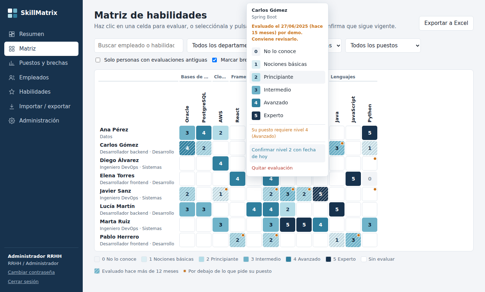
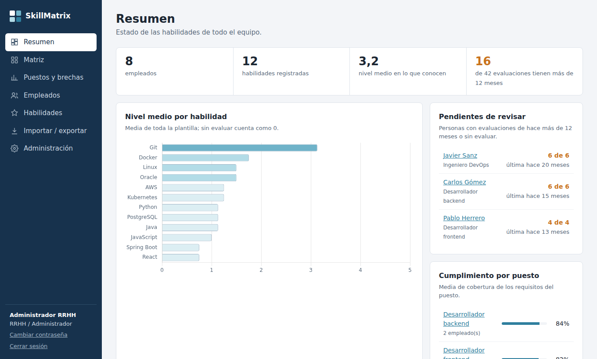
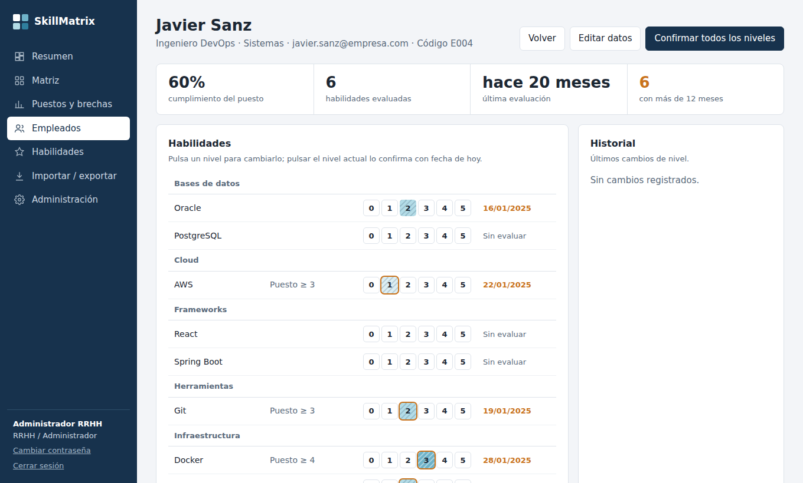
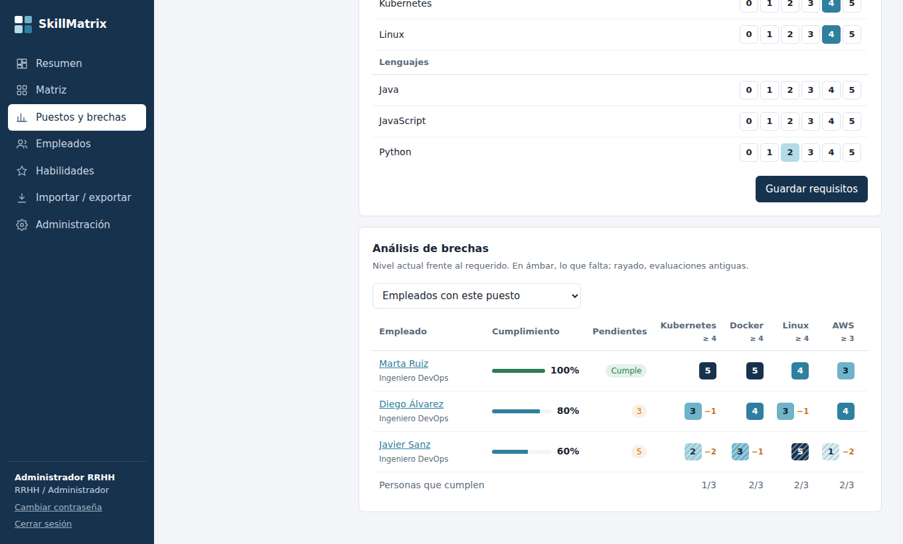

# SkillMatrix

[](https://github.com/Arzu260/skillmatrix/actions/workflows/ci.yml)

Aplicación web para registrar y consultar las **habilidades técnicas de los empleados** (Oracle, Kubernetes,
Java…) en una escala de 0 a 5. Permite compararlas con lo que exige cada puesto, detectar evaluaciones
desactualizadas y compartir los datos con otras aplicaciones mediante una **API REST**.



## Funcionalidades

- **Matriz de habilidades** empleados × habilidades como mapa de calor, editable con clic o teclado, con filtros
  por departamento, categoría y puesto.
- **Escala 0-5** (0 No lo conoce · 1 Nociones básicas · 2 Principiante · 3 Intermedio · 4 Avanzado · 5 Experto),
  distinta de «sin evaluar».
- **Fecha de la última evaluación** de cada nivel. Las evaluaciones con más de *N* meses (12 por defecto,
  configurable) se marcan como desactualizadas.
- **Puestos y brechas**: nivel requerido por puesto, % de cumplimiento de cada persona y búsqueda de candidatos
  en toda la plantilla.
- **Resumen**: indicadores, habilidades con pocos expertos, personas pendientes de revisar y últimos cambios.
- **Histórico** de todos los cambios de nivel, indicando quién los hizo y desde dónde (web, API o importación).
- **Importación y exportación** en Excel y CSV.
- **Usuarios con roles**: RRHH/Administrador, Manager (edita) y Solo lectura.
- **API REST** documentada con OpenAPI/Swagger y tokens por aplicación (lectura o lectura y escritura).

| Resumen | Ficha de empleado | Brechas por puesto |
|---|---|---|
|  |  |  |

## Tecnología

| Capa | Elección | Motivo |
|---|---|---|
| Backend | Python 3.10+ · Flask 3 · Waitress | Sencillo de mantener; Waitress funciona igual en Windows y Linux. |
| Base de datos | PostgreSQL 13+ (probado con 16) · psycopg 3 | Migraciones automáticas al arrancar. |
| Frontend | HTML + CSS + JavaScript, sin frameworks ni compilación | No requiere Node.js ni ningún paso de build. |
| Librerías web | Chart.js, Swagger UI (incluidas en `static/vendor`) | Funciona sin acceso a internet. |

## Puesta en marcha rápida

**Con Docker** (la forma más rápida de probarlo):

```bash
git clone https://github.com/Arzu260/skillmatrix.git skillmatrix
cd skillmatrix
docker compose up -d
```

Abre http://localhost:5000 y entra con `admin` / `admin`. Se cargan datos de ejemplo.

**Sin Docker** (necesitas Python 3.10+ y un PostgreSQL accesible):

```bash
python -m venv .venv
.venv/bin/pip install -r requirements.txt        # Windows: .venv\Scripts\pip ...
cp .env.example .env                             # Windows: copy .env.example .env
# edita .env y pon la conexión en DATABASE_URL
.venv/bin/python app.py
```

En Windows basta con ejecutar `iniciar.bat`, que hace todos estos pasos.

## Documentación

| Documento | Contenido |
|---|---|
| [Guía de despliegue](docs/DESPLIEGUE.md) | Requisitos, configuración y despliegue en servidor Windows, Linux, Docker y Kubernetes; HTTPS, copias de seguridad, actualizaciones y lista de comprobación. |
| [Guía de la API](docs/API.md) | Autenticación con tokens, operaciones, ejemplos (curl, Python, PowerShell) y reglas de negocio. |
| [Arquitectura](docs/ARQUITECTURA.md) | Estructura del código, modelo de datos, seguridad y decisiones de diseño. |
| [Guía de usuario](docs/GUIA_USUARIO.md) | Uso de la aplicación para RRHH, managers y lectores. |
| [Cómo contribuir](CONTRIBUTING.md) | Entorno de desarrollo, pruebas, convenciones y cambios en la base de datos. |
| [Cambios](CHANGELOG.md) | Historial de versiones. |

Con la aplicación en marcha, la documentación interactiva de la API está en `/api/docs`.

## Estructura del proyecto

```
├── app.py                  Arranque, configuración y rutas generales
├── api.py                  API REST /api/v1 (la usan la web y otras aplicaciones)
├── auth.py                 Sesiones web y tokens de API
├── services.py             Lógica de negocio: evaluaciones, caducidad, brechas
├── excel_io.py             Importación y exportación Excel/CSV
├── db.py                   Pool de conexiones, migraciones y datos de ejemplo
├── openapi.py              Especificación OpenAPI de la API
├── migrar_desde_sqlite.py  Migración de datos desde la versión 1 (SQLite)
├── static/                 Interfaz web
├── tests/                  Pruebas automáticas (pytest)
├── deploy/                 Ejemplos de despliegue: systemd, nginx, Kubernetes
├── docs/                   Documentación
├── Dockerfile · docker-compose.yml
└── .env.example            Plantilla de configuración
```

## Estado

Versión 2.0. Revisión pendiente por el equipo: los comentarios se recogen como *issues* o *pull requests*.
