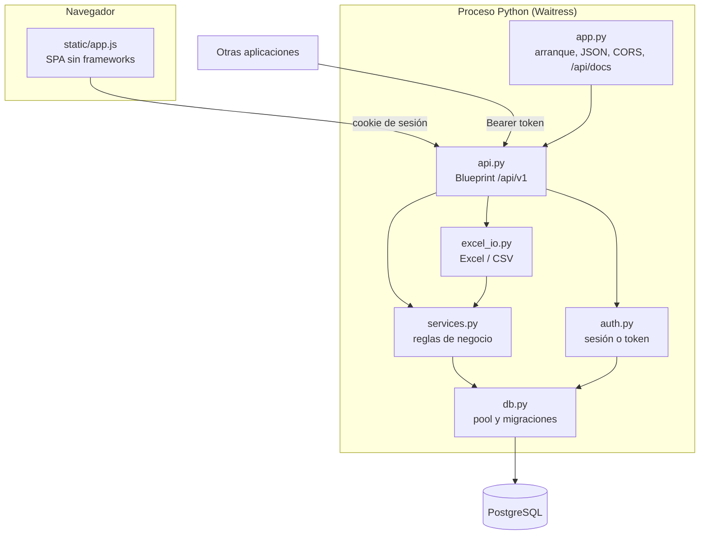
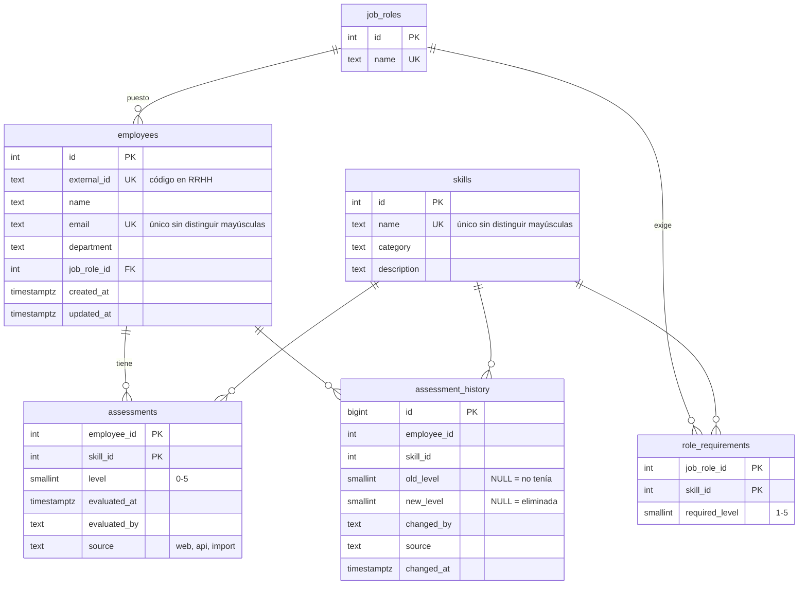

# Arquitectura

Documento para quien vaya a revisar o mantener el código.

## Visión general

| Módulo | Responsabilidad |
|---|---|
| `app.py` | Crea la aplicación Flask, carga `.env`, serializa JSON (fechas ISO, decimales), CORS, rutas de la interfaz, `/api/docs` y `/api/health`. |
| `api.py` | Todos los endpoints de `/api/v1`: validación de entrada, consultas y respuestas. |
| `auth.py` | Identifica al llamante (sesión web o token), comprueba permisos y protege contra CSRF. |
| `services.py` | Lógica reutilizable: registrar evaluaciones y su histórico, caducidad, cálculo de brechas y resolución de empleados y habilidades por id, código o email. |
| `excel_io.py` | Importación y exportación Excel/CSV en los formatos *matriz* y *evaluaciones*. |
| `db.py` | Pool de conexiones (psycopg 3), conexión por petición, migraciones versionadas y datos de ejemplo. |
| `openapi.py` | Especificación OpenAPI 3 (se mantiene a mano junto a `api.py`). |
| `gestion.py` | Tareas de administración desde consola. |
| `static/` | Interfaz: `index.html`, `app.js` (enrutado por `#hash`), `styles.css`, librerías de terceros en `vendor/`. |

## Modelo de datos

Tablas de soporte: `users` (usuarios de la web, contraseña con hash de Werkzeug), `api_tokens` (solo el
SHA-256 del token), `settings` (clave-valor: `stale_months`, `secret_key`) y `schema_version`.

**Semántica importante**

- **Sin fila en `assessments` = sin evaluar.** `level = 0` significa «no lo conoce» y es una evaluación con fecha.
- **Desactualizada** = `evaluated_at < now() - stale_months`. Se calcula al consultar; no se guarda.
- **Revisar sin cambiar** actualiza `evaluated_at` pero no escribe en el histórico, que solo recoge cambios de nivel.
- En el cálculo de brechas, lo no evaluado cuenta como 0.
- Cumplimiento del puesto = Σ min(nivel, requerido) / Σ requerido. Superar un requisito no compensa no llegar a otro.

## Peticiones y transacciones

- Cada petición toma una conexión del pool la primera vez que la necesita (`db.conn()`) y la devuelve al
  terminar (`teardown_appcontext`), **deshaciendo lo que no se haya confirmado**.
- Los endpoints llaman a `commit()` explícitamente cuando todo es válido. Un error a mitad no deja datos a medias.
- `POST /assessments` valida y resuelve todas las filas antes de escribir ninguna (todo o nada).

## Migraciones

`db.MIGRATIONS` es una lista ordenada de `(versión, sql)`. Al arrancar, dentro de una transacción y con
`pg_advisory_xact_lock`, se aplican las versiones mayores que la registrada en `schema_version`.
Una migración publicada **nunca se modifica**: los cambios se añaden como una versión nueva
(ver [CONTRIBUTING](../CONTRIBUTING.md#cambios-en-la-base-de-datos)).

## Seguridad

| Aspecto | Medida |
|---|---|
| Contraseñas | Hash de Werkzeug (scrypt/pbkdf2 con sal). Mínimo 8 caracteres. |
| Sesiones | Cookie firmada, `HttpOnly`, `SameSite=Lax` y `Secure` con `COOKIE_SECURE=1`. Duración de 10 horas. |
| Tokens de API | 256 bits aleatorios con prefijo `smx_`. Solo se guarda su SHA-256. Revocables. Alcance `read` o `write`, nunca administración. |
| CSRF | Las peticiones de escritura con cookie deben llevar la cabecera `X-Requested-With: SkillMatrix`, que un formulario de otro sitio no puede enviar, además de `SameSite=Lax`. |
| Autorización | Decorador `require("read"\|"write"\|"admin")` en cada endpoint. Lector → read; manager → read+write; admin → todo. |
| Inyección SQL | Todas las consultas usan parámetros de psycopg. Los fragmentos dinámicos (`WHERE`, columnas de `UPDATE`) se construyen solo a partir de listas fijas del código. |
| XSS | La interfaz escapa todo dato antes de insertarlo en el HTML (`esc()`). |
| Auditoría | Histórico de niveles con autor y origen. Último uso de cada token. |
| Dependencias externas | Ninguna en tiempo de ejecución: Chart.js y Swagger UI se sirven desde `static/vendor`. La fuente tipográfica se pide a Google Fonts, con alternativa del sistema si no hay acceso. |

Pendiente de valorar: inicio de sesión corporativo (Microsoft Entra ID / LDAP), límite de intentos de login y
política de caducidad de tokens.

## Decisiones de diseño

| Decisión | Alternativas | Motivo |
|---|---|---|
| Flask + Waitress | Django, FastAPI; Gunicorn | Código pequeño y directo. Waitress funciona igual en Windows y Linux. |
| SQL directo con psycopg | ORM (SQLAlchemy) | Consultas de informe con agregados y `LATERAL` más legibles en SQL. Pocas tablas. |
| Migraciones propias | Alembic | Suficiente para un único esquema y sin dependencia adicional. Revisable si el modelo crece. |
| Frontend sin frameworks ni build | React, Vue | Sin Node.js ni compilación: se despliega copiando archivos. Unas 800 líneas de JavaScript. |
| La web usa la misma API que las integraciones | API separada para terceros | Una sola implementación que mantener y probar. La API se prueba con cada uso de la web. |
| Clave de sesión guardada en la BD | Archivo local | Varias instancias comparten la clave sin configuración adicional. |
| Tokens propios | OAuth2 client credentials | Sencillo de operar sin proveedor de identidad. Se puede sustituir más adelante. |
